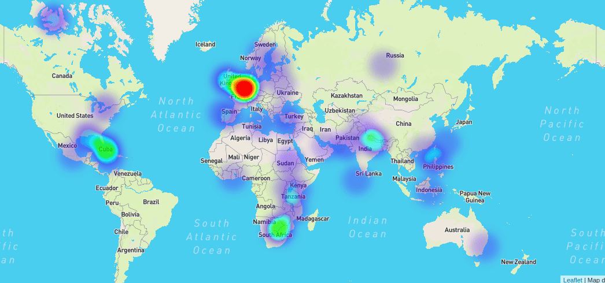
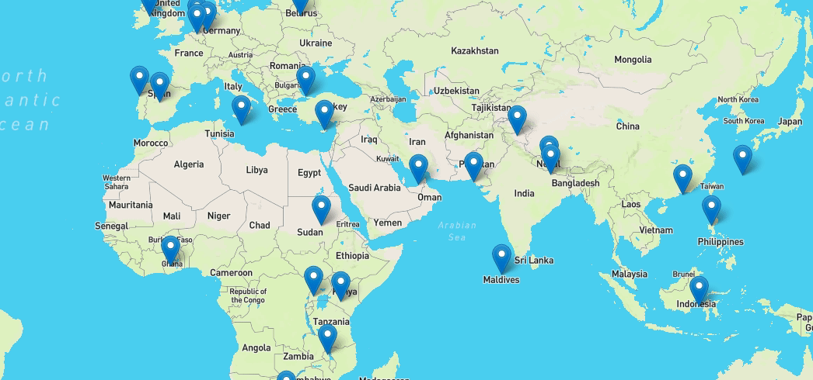
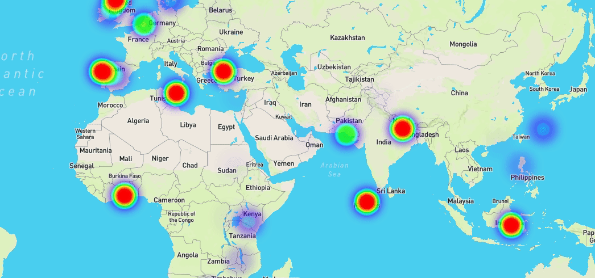
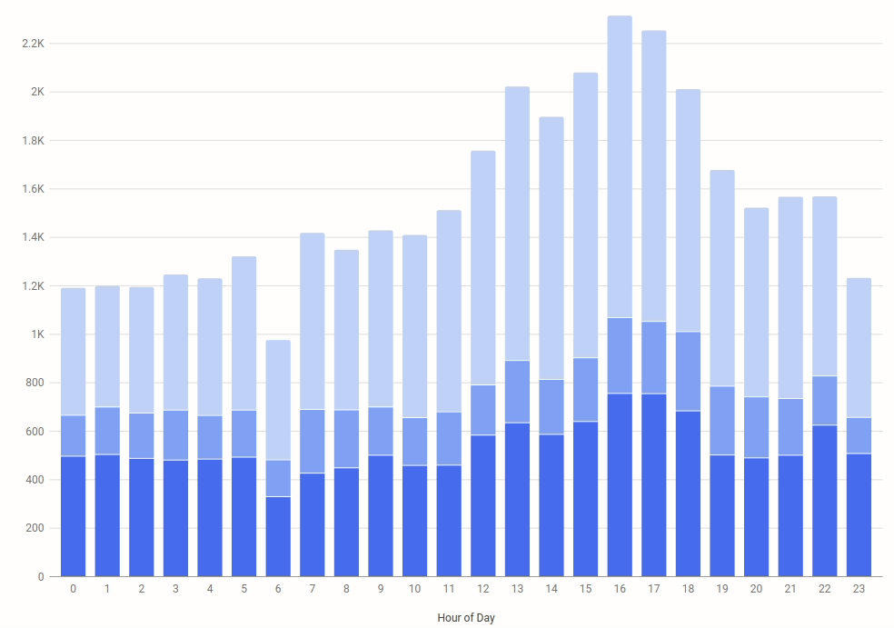
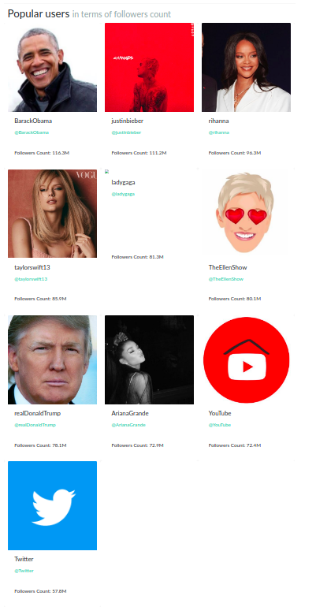
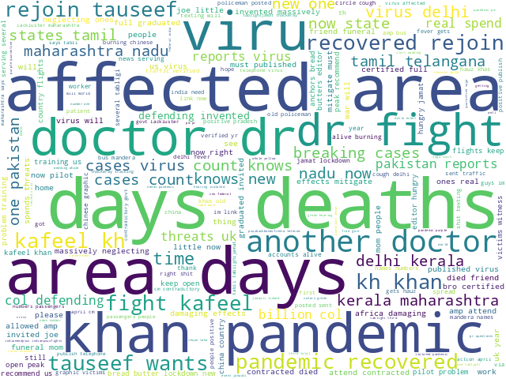

<h1 align="center">
  covidTweet
</h1>

<h3 align="center">
	Tweet Analyzer for COVID-19
</h3>

	

---

## Table of Contents

- [Introduction](#introduction)
- [About covidTweet](#about-covidTweet)
- [Technology Stack](#technology-stack)
- [Features / Screenshots](#features--screenshots)
- [Execution Flowchart](#execution-flowchart)
- [Entity Relationship Diagram](#entity-relationship-diagram)
- [Contributors](#contributors)

## Introduction

Twitter is an extremely powerful micro-blogging platform with over 300 million monthly active users and 145 million daily active users. At-least 500 million tweets are sent out per day ([source](https://www.oberlo.in/blog/twitter-statistics)). Such a powerful source of information can be tapped using its powerful API which allows us to access a lot of data from the website seamlessly.

Amidst the global pandemic of COVID-19, Twitter has witnessed hundreds of millions of tweets from millions of users. We can say without any doubt that this is a lot of information and several meaningful inferences can be derived from the same. With covidTweet,, we explore the possibility of harnessing this data and visualising it.

## About covidTweet

covidTweet analyses some around 54000 tweets (a drop in the ocean) by fetching, storing and processing data on a relational model. A tweet contains a lot of information, often much more than what directly appears over the platform normally. We take what is useful in our context to prepare our schema. 

## Technology Stack

- PostgreSQL v12
- Flask
- SQLAlchemy ORM
- Bootstrap
- HTML/CSS/JavaScript

## Features / Screenshots

### Heatmap based on number of tweets posted

### Map indicating most active hour of day

### Heatmap based on mean sentiment score

### Tweet frequency by time with sentiment

### Most popular hashtags

### Most popular users

### Most popular tweets

### Most positive tweets

### Most negative tweets

### Wordclouds based on frequency of words

#### All tweets

#### Positive tweets

#### Negative tweets

## Execution Flowchart

The following flowchart explains our system methodology:

The steps can be described as under:

- Twitter Search API’s free edition misses out on a lot of tweets. Also, it is slow for our purposes. Therefore, we need a list of tweet ids which we can fetch using the Twitter Lookup API. Thankfully, IEEE Dataport has published [a dataset](https://ieee-dataport.org/open-access/corona-virus-covid-19-tweets-dataset) of tweets related to COVID-19, which we use. We take ~50,000 tweets from April 8th 2020’s data which is large enough to show trends and small enough to not break things down.
- We fetch the tweets and serialize them in a binary file. Tweets can be fetched by sending HTTP requests to their server with our API key and secret code. We use Tweepy to make things easier. 
- We create a relational model decomposed up to 3NF, with all the required relationships and constraints. We add the auxiliary tables required for several functionalities, eg., coordinates (fetched from external API), sentiment scores, lists of positive/negative/bad words etc. 
- We insert the data into our relational model in appropriate chronology, taking care of the integrity and referential constraints.
- We create PL/SQL blocks to generate meaningful results and inferences.
- We display the data to the front-end by calling these blocks and writing code to display them.

## Entity Relationship Diagram
<h3 align="center">
  
</h3>

## Contributors

|  |   |
| ---- | ---- |
| [Yashraj Kakkad](https://github.com/yashrajkakkad) | [Prayag Savsani](https://github.com/PrayagS) |
